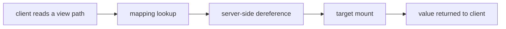

# openbao-plugin-secrets-voidstar

[](https://github.com/NavistAu/openbao-plugin-secrets-voidstar/actions/workflows/ci.yml)
[](LICENSE)

openbao-plugin-secrets-voidstar is an OpenBao secrets engine that serves
read-only virtual views: paths under its mount hold no secret material of
their own, only pointers ("mappings") to real paths in other mounts (KV v2,
other static engines). Reading a view path dereferences the mapping
server-side and returns the target's value — the client sees only the
value, never the mapping or the target path. `void*` names the idea: an
untyped reference, meaningful only once dereferenced.

May work with HashiCorp Vault — untested, unsupported.

## Value proposition

A secret's canonical copy lives at exactly one path, in whichever engine
and shape best fits how it is produced or rotated. Every consumer that
needs it under a different, consumer-organized path gets a view instead of
a copy, so N consumers reading the same secret under N different paths
never means N places to rotate it. Dereference happens server-side, so no
client — a CI secret broker, a deploy-time resolver, a human with the
CLI — ever contains resolution logic. Every client stays a dumb reader.

## Terms

The domain reuses common OpenBao words for specific meanings. This table
is the disambiguation.

| Term | Meaning |
|---|---|
| view | A path under voidstar's mount that a consumer reads. A view holds no secret material — only a mapping. |
| mapping | The stored pointer behind a view. A mapping records a target, an optional adapter override, and quarantine state. |
| target | The canonical `<mount>/<path>[#field]` string a mapping points to. A target names the real location voidstar dereferences. |
| mount | An OpenBao secrets engine mount point. voidstar's own mount (`vs/` in this document's examples) differs from a target's mount. A target's mount is wherever voidstar reads the real value from. |

## How it works



A read of `vs/data/<view>` looks up `<view>`'s mapping in voidstar's own
storage. The mapping names a target. voidstar performs the target read
itself, over its own loopback connection to the OpenBao instance it is
mounted in. The target's value comes back through voidstar and out to the
client in KV v2 data-read shape. The client never contacts the target
mount directly and never sees the target path.

## When to use it

Use voidstar when several consumers need the same secret organized under
different, consumer-specific paths, and you want one canonical copy with
disposable, revocable views onto it instead of duplicated values. Use it
when you want dereference to run once, server-side, so no client needs
resolution logic of its own.

## When not to use it

Do not rely on `bao kv` CLI compatibility. The CLI does not recognize a
custom plugin mount as KV v2, so only the raw wire shape is
compatible — use `bao read`/`bao list` or an HTTP client instead. Do not
use voidstar for anything that needs write access through a view — every
write goes through the admin surface's mapping calls, or the target's own
mount, never through `data/<view>`. Do not point a mapping at a target
whose engine issues leases on read — voidstar's static-contract detection
quarantines any view whose target starts returning a lease.

## Requirements

voidstar is built against `github.com/openbao/openbao/sdk/v2` v2.6.2 and
`github.com/openbao/openbao/api/v2` v2.6.0 (see `go.mod`). Run it against
an OpenBao server compatible with that SDK/API generation. Building from
source needs Go 1.25 (see `mise.toml`).

## Installation

### From a release tarball

Download the tarball and its checksum for your platform, verify the
checksum, and extract the binary.

```sh
VERSION=0.1.0
ARCH=amd64   # or arm64
curl -LO "https://github.com/NavistAu/openbao-plugin-secrets-voidstar/releases/download/v${VERSION}/openbao-plugin-secrets-voidstar_${VERSION}_linux_${ARCH}.tar.gz"
curl -LO "https://github.com/NavistAu/openbao-plugin-secrets-voidstar/releases/download/v${VERSION}/openbao-plugin-secrets-voidstar_${VERSION}_linux_${ARCH}.tar.gz.sha256"
sha256sum -c "openbao-plugin-secrets-voidstar_${VERSION}_linux_${ARCH}.tar.gz.sha256"
tar -xzf "openbao-plugin-secrets-voidstar_${VERSION}_linux_${ARCH}.tar.gz"
```

### From source

Clone the repository and build the plugin binary with Go 1.25.

```sh
git clone https://github.com/NavistAu/openbao-plugin-secrets-voidstar.git
cd openbao-plugin-secrets-voidstar
mise exec -- go build -o openbao-plugin-secrets-voidstar ./cmd/openbao-plugin-secrets-voidstar
```

### Register and mount

Copy the binary into the server's plugin directory, then register it by
its checksum and mount it.

```sh
SHA256=$(sha256sum openbao-plugin-secrets-voidstar | cut -d ' ' -f1)
bao plugin register -sha256="$SHA256" -command=openbao-plugin-secrets-voidstar secret vs
bao secrets enable -path=vs vs
```

### Loopback AppRole

voidstar authenticates to its own OpenBao instance via AppRole to
perform dereference reads. Create the AppRole with a multi-use,
non-expiring `secret_id`: `secret_id_num_uses=0` and `secret_id_ttl=0`.
A single-use or TTL'd `secret_id` permanently breaks voidstar's
restart recovery (see Design constraints).

```sh
bao auth enable approle
bao write auth/approle/role/voidstar-loopback \
  token_policies=voidstar-loopback \
  secret_id_num_uses=0 \
  secret_id_ttl=0
bao read auth/approle/role/voidstar-loopback/role-id
bao write -f auth/approle/role/voidstar-loopback/secret-id
```

`token_policies` names a policy granting the resulting token read
access on every target path voidstar's mappings will dereference. The
`role-id` read and `secret-id` write each print a value; use them in
the config write below.

### Configure the engine

Write the engine configuration once it is mounted (see Configuration
reference below for every field):

```sh
bao write vs/admin/config \
  role_id=<role-id-from-above> \
  secret_id=<secret-id-from-above> \
  api_addr=https://127.0.0.1:8200
```

## Configuration reference

Every path voidstar registers, and every field its writable paths accept.
`<mount>` is the path voidstar is mounted at (`vs/` in the examples
above).

### Consumer surface

| Path | Verb | Behavior |
|---|---|---|
| `<mount>/data/<view>` | GET | Dereferences `<view>` and returns `{data: {data: <target value>, metadata: <synthetic>}}`. |
| `<mount>/data/<view>` | POST, PUT, PATCH, DELETE | 405: voidstar is read-only. |
| `<mount>/metadata/<view>` | GET | Returns a synthetic KV v2 metadata document for `<view>`. |
| `<mount>/metadata/<prefix>` | LIST | Lists direct children of `<prefix>` from the mapping keys, sorted, directories suffixed `/`. An empty result is a 404. |
| `<mount>/metadata/<view>` | POST, PUT, PATCH, DELETE | 405: voidstar is read-only. |
| `<mount>/config` | any verb, including GET | 405: not the KV config endpoint. Engine config lives at `<mount>/admin/config`. |
| `<mount>/delete/<view>` | any verb, including GET | 405: voidstar has no delete semantics. |
| `<mount>/undelete/<view>` | any verb, including GET | 405: voidstar has no undelete semantics. |
| `<mount>/destroy/<view>` | any verb, including GET | 405: voidstar has no destroy semantics. |
| `<mount>/detailed-metadata/<view>` | any verb, including GET | 405: voidstar has no detailed-metadata semantics. |
| anything else, excluding `<mount>/admin/*` | any verb | 404. |

### Admin surface

A separate path family from the consumer surface — grant read/write on it
separately.

| Path | Verb | Effect |
|---|---|---|
| `<mount>/admin/map/<view>` | GET | Reads the mapping entry for `<view>`. |
| `<mount>/admin/map/<view>` | POST | Creates or replaces the mapping entry for `<view>`. Clears any existing quarantine. |
| `<mount>/admin/map/<view>` | DELETE | Deletes the mapping entry for `<view>`. |
| `<mount>/admin/map/<prefix>` | LIST | Enumerates mapping keys under `<prefix>`. |
| `<mount>/admin/config` | GET | Reads the engine configuration. Omits `secret_id`. |
| `<mount>/admin/config` | POST | Replaces the engine configuration wholesale — every write requires `role_id`, `secret_id`, and `api_addr`. |
| `<mount>/admin/status` | GET | Reads loopback client health, mapping count, failure counters, and quarantined mappings. Returns no secret material. |

### Mapping fields (`POST <mount>/admin/map/<view>`)

| Field | Type | Default | Effect |
|---|---|---|---|
| `target` | string | none (required) | Canonical target the view points to: `<mount>/<path>[#field]`. Rejected if URL-encoded, if it has a query string, a `.` or `..` segment, a leading, trailing, or repeated slash, more than one `#field` suffix, or fewer than two path segments. Also rejected if its mount is `auth`, `sys`, `identity`, `cubbyhole`, voidstar's own mount, or absent from a configured `target_mount_allowlist`. |
| `adapter` | string | `""` (auto-detect) | Overrides adapter selection. `""` picks `kv2` when the target's second path segment is `data`, else `raw`. The only other valid values are `kv2` and `raw`. |

### Config fields (`POST <mount>/admin/config`)

| Field | Type | Default | Effect |
|---|---|---|---|
| `approle_mount` | string | `approle` | Auth mount voidstar logs into for its loopback AppRole. |
| `role_id` | string | none (required) | Loopback AppRole `role_id`. |
| `secret_id` | string | none (required) | Loopback AppRole `secret_id`. Write-only — never returned on read. Must be issued with `secret_id_num_uses=0` and `secret_id_ttl=0` (see Design constraints). |
| `api_addr` | string | none (required) | Address voidstar dereferences targets against. |
| `expose_targets` | bool | `false` | Includes the target mount name in synthetic metadata and error responses when `true`. |
| `target_mount_allowlist` | comma-separated string list | unset (every mount permitted) | Restricts mapping targets to these exact mount names. Fixed rejects (`auth`, `sys`, `identity`, `cubbyhole`, voidstar's own mount) apply regardless. |

## Errors and logs

### Dereference failure classes

Returned as `voidstar: <message> for view "<view>"`, with
`(target mount "<mount>")` appended only when `expose_targets=true`.

| Failure class | Message | HTTP status |
|---|---|---|
| upstream_read_failure | `upstream dereference failed` | 502 |
| missing_field | `target field not found` | 502 |
| lease_violation | `static-contract violation` | 502 |
| quarantined_fastfail | `view quarantined` | 502 |

### Other request errors

| Situation | Message | HTTP status |
|---|---|---|
| No mapping for a `data`/`metadata` read | `voidstar: no mapping for view "<view>"` | 404 |
| Empty `metadata` list result | `voidstar: no views under prefix "<prefix>"` | 404 |
| Unmatched path (catch-all) | `voidstar: "<path>" not found` | 404 |
| Write verb on `data/<view>` or `metadata/<view>` | `voidstar: read-only secrets engine; <path> is read-only` | 405 |
| Any verb on a KV-reserved path | `voidstar: read-only secrets engine; <reason>` | 405 |
| kv2-adapter target missing its `data.data` envelope | `voidstar: kv2 adapter: response missing data.data envelope` | 502 |

### Mapping and config write validation

Returned as an error response body, no fixed HTTP status beyond the
SDK's default for a validation failure.

| Cause | Message |
|---|---|
| `role_id` empty | `role_id is required` |
| `secret_id` empty | `secret_id is required` |
| `api_addr` empty | `api_addr is required` |
| `view` empty on a map write | `view path is required` |
| `adapter` not `""`, `kv2`, or `raw` | `adapter "<value>" must be "kv2" or "raw"` |
| `target` empty | `target is required` |
| `target` URL-encoded | `target must not be URL-encoded` |
| `target` has a query string | `target must not contain a query string` |
| `target` has zero or more than one non-empty `#field` suffix | `target must have exactly one non-empty #field suffix` |
| `target` has fewer than two path segments | `target must be <mount>/<path>` |
| `target` has a leading, trailing, or repeated slash | `target must not have a leading slash, trailing slash, or repeated slashes` |
| `target` has a `.` or `..` segment | `target must not contain . or .. segments` |
| `target`'s mount is voidstar's own mount | `target must not reference the engine's own mount` |
| `target`'s mount is rejected or not allowlisted | `target mount "<mount>" is not permitted` |

### Operator-side log lines

Logged at `Warn`, unredacted — these are operator-facing, not
consumer-facing.

| Event | Fields |
|---|---|
| `voidstar: dereference failed` | `view`, `target_mount`, `cause` |
| `voidstar: lease revocation failed, recycling loopback token` | `view`, `target_mount`, `error` |
| `voidstar: loopback token self-revoke also failed` | `view`, `target_mount`, `error` |
| `voidstar: failed to persist quarantine` | `view`, `target_mount`, `error` |

## Troubleshooting

**`GET <mount>/data/<view>` returns 404.** No mapping exists for
`<view>`. Confirm with `bao read <mount>/admin/map/<view>`. Write a
mapping before reading the view.

**`GET <mount>/data/<view>` returns 502 `view quarantined`.** A prior
read found the target violating the static contract (it returned a
lease). Check `bao read <mount>/admin/status` for `quarantined_mappings`
and its `quarantine_cause`. Fix the target so it stops issuing a lease,
then rewrite the mapping to clear quarantine.

**`GET <mount>/data/<view>` returns 502 `upstream dereference failed`.**
The loopback read to the target failed. Check
`bao read <mount>/admin/status` for `loopback.client_connected` and
`loopback.init_last_error`. Verify `role_id`, `secret_id`, and
`api_addr` in `<mount>/admin/config`, and that the AppRole's `secret_id`
has `secret_id_num_uses=0` and `secret_id_ttl=0`.

**`GET <mount>/data/<view>` returns 502 `target field not found`.** The
mapping's `#field` suffix names a key absent from the target's data.
Read the target directly and correct the mapping.

**Plugin registration fails.** Confirm the `-sha256` value matches the
binary exactly: `sha256sum openbao-plugin-secrets-voidstar`. OpenBao
rejects a catalog entry whose checksum does not match.

**`<mount>/admin/status` shows `client_connected: false`.** The loopback
AppRole login has not yet succeeded. Check `init_last_error` and
`init_consecutive_failures` in the same response — voidstar retries
construction with exponential backoff, capped at five minutes between
attempts.

## Design constraints

These constraints are enforced by the code, not just documented:

- **Read-only, explicitly.** The consumer surface (`data/*`,
  `metadata/*`) never accepts a write. Write verbs are registered with
  an explicit 405 naming voidstar, rather than left unregistered, so the
  error text is voidstar's own rather than the SDK's generic one
  (`backend/paths_405.go`).
- **KV-reserved paths always 405.** `config`, `delete/*`, `undelete/*`,
  `destroy/*`, and `detailed-metadata/*` are 405 for every verb,
  including GET — voidstar deliberately does not implement KV v2's
  config/delete/undelete/destroy semantics. `<mount>/config` is not the
  KV config endpoint; engine configuration lives at
  `<mount>/admin/config` (`backend/paths_reserved.go`).
  The catch-all 404 covers anything else unregistered under the mount,
  excluding the `admin/*` family (`backend/paths_notfound.go`).
- **Dereference is server-side only.** voidstar performs the target read
  itself, over its own loopback connection. No client-side resolution
  logic exists or is needed.
  (`backend/dereference.go`).
- **Static-contract enforcement.** Every target read is expected to
  return a value with no lease and no renewable flag. A response
  carrying either violates the contract: voidstar revokes what it can
  (`sys/leases/revoke`, falling back to revoking its own loopback token
  on a revoke failure), quarantines the mapping so every subsequent read
  fast-fails with a 502 and no loopback call, and fails the triggering
  read with the same 502. Only rewriting the mapping clears quarantine
  (`backend/dereference.go`, `checkStaticContract`).
- **Loopback authentication contract.** The AppRole `secret_id` must be
  multi-use and non-expiring (`secret_id_num_uses=0`,
  `secret_id_ttl=0`). voidstar performs lazy re-login on any 403 or
  token-expiry from a loopback call, including after a process restart
  at any point in the `secret_id`'s life — a single-use or TTL'd
  `secret_id` breaks that restart recovery permanently
  (`backend/loopback.go`).
- **Target canonicalization.** Target strings are opaque and validated
  against a fixed grammar; `auth`, `sys`, `identity`, `cubbyhole`, and
  voidstar's own mount are always rejected as targets, regardless of any
  configured `target_mount_allowlist` (`backend/mapping.go`,
  `backend/config.go`).
- **Secret confidentiality.** A mapping never stores a target's secret
  value — only its target string, adapter override, write time, and
  quarantine state. Target secret values are never logged. Only the
  target mount name is logged (unconditionally, operator-side) and
  reaches a consumer-visible error or metadata response only when
  `expose_targets=true`.

## Tests

`backend/` is the authoritative test suite — it exercises every path,
verb, and failure class through the framework's request/response layer
against a scripted `FakeLoopbackClient`, with no network and no real
OpenBao server:

```sh
mise exec -- go test ./...
```

`bench/` is a separate, manual drill against a real OpenBao server and a
throwaway lease-emitting test plugin. It exists because the static-contract
detection and quarantine path need a genuine minted lease on the wire —
something a scripted fake cannot produce — to prove real. It is not part
of CI and does not run automatically; see the scripts under `bench/` to
run it by hand.

## CI

GitHub Actions runs `go vet` and `go test -race ./...` on every push and
pull request. A private-forge Woodpecker CI also runs the same build and
test suite on every push.

## Contributing

Contributions are welcome. See [CONTRIBUTING.md](CONTRIBUTING.md) for the
build/test workflow, branch model, and the bar for new configuration
options. This project follows the
[Contributor Covenant](CODE_OF_CONDUCT.md).

## Security

See [SECURITY.md](SECURITY.md) for how to report a suspected
vulnerability.

## License

MPL-2.0. See [LICENSE](LICENSE).
